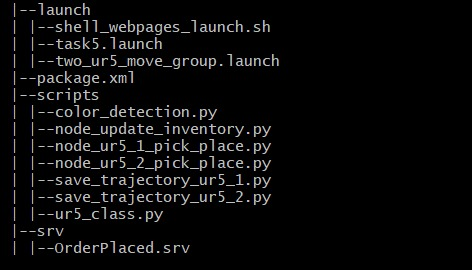

#pkg_task5 

##color_detection 
This script is used to detect colour It detect colour based on assumption that size of image will not change and box position will 
also not change. It assign colour to package name as package_name is fixed for fixed position.

1. **Launch**
1. **script**
1. **config**
1. **srv**

#pkg_ros_iot_bridge 

1. **Action**
1. **Message**
1. **Config**
1. **Script**
