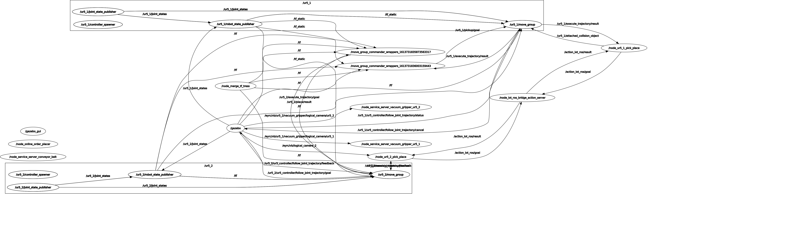

**Implementation**
======================

**Package Detection**
---------------------------
1. Get raw iamge published on ROS topic
2. Crop image to remove unwanted part like background.
3. As Box position is fixed on shelf so pixel position for different box is fixed in image of shelf. Use predefine value start_row,end_row,start_coloum,end_coloum for image croping to extract particular box from image.
4. Do this with all box in image as position to place box in shelf is fixed. 
5. Crop image in order the box is placed and pass each cropped image in QR detector function to detect colour of image.
6. Store data in dictionary with position of box as key and colour of box as value.

**Sending Data to IMS**
-------------------------
1. Store value in different attribute so it can be sent to different sheet of IMS.
2. Different method **format** order data according to requirement of Inventory management sheet.
3. After formating data it is sent to action server to handle different goal.

**Ros IOT bridge** 
-----------------------
1. Receive orders from mqtt topic by subscribing to it.also update it on incoming order sheet simultatenesly.
2. Short order by their priority abailable at that time and place high priority order first.update on sheet.
3. Use ur5_2 arm to sort package where colour of package is knoen by fetching data from list of placed order by ur5_1.update on sheet.

**Receiving & Dispatching Order**
------------------------------------
1. start kepping track of order placed and order completed.
2. Map item name to colour of package, which is used to acess colour by giving item ordered.
3. map colour of package with it's position and map position with file_name of saved trajectory.
4. detect colour of package and update inventory sheet.
5. subscribe to topic for receiving order and update incoming_order sheet once recieved.
6. sort order and take high priority order first.
7. use item from order information and fetch file name for saved trajectory to go to desired position.
8. grab package and  go to conveyer belt and place order.
9. update dispatched sheet.
10. kepp repeating step 6 to 9.
 
**Shipping of order** 
------------------------
1. subscribe to logical camera 2 which is used to know if packag is available.
2. If package is abailable then save it's position and name.
3. Start running conveyer belt at max speed. 
4. Run conveyer till package is abailable at desired location.
5. Use service to know which order have been recently dispatched by ur5_1.
6. Move ur5_2 to fetching position and if box is present grab it.
7. use order information from service to know item and then map it to colour.
8. place package in bin that match maped colour to item.
9. repeat process.

   Rqt graph showing how each node intract

